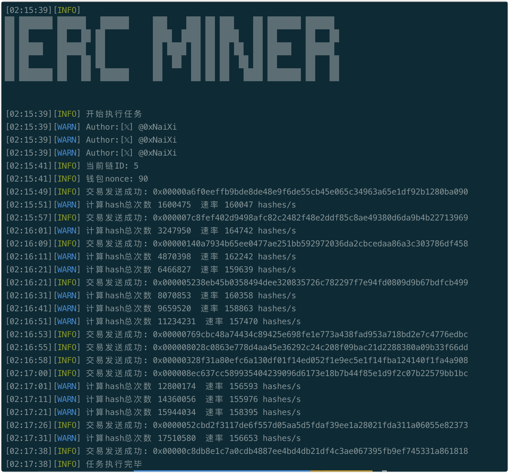
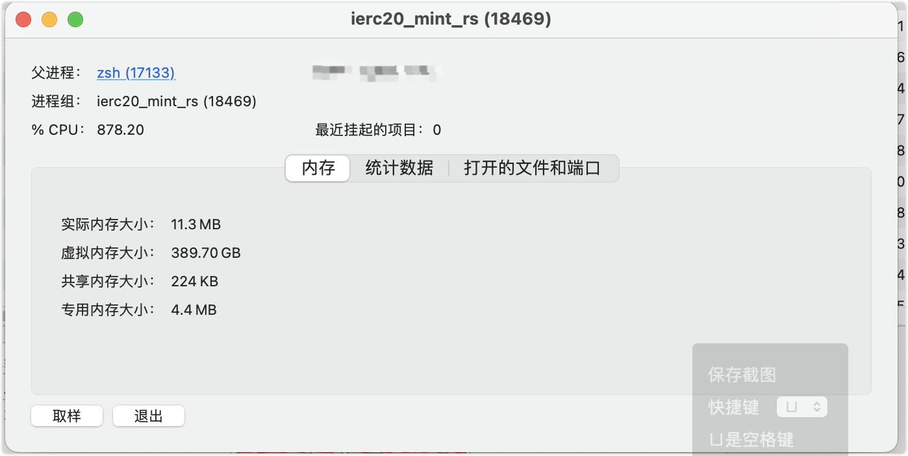

# ierc20_mint rust 版本 

# 展示



测试地址
https://goerli.etherscan.io/address/0xd5B4D80B732322a8E7e1690253Fc180E0aE14be0
# 使用方法
1,下载本项目,自行编译或者运行别人编译好的版本
```
# 如果安装过rust 可以输入命令(务必设置好.env文件内容)
cargo run --release
```
2,自行设置.env文件内容

3,运行


# 提示
1. 先1张测试成功后再加数量, 或者使用其他gas低的链rpc先测试使用
2. 有时因为算力过高或者难度过低,会连续挖到两个,两笔交易在同一区块内打包时,官方只会认第一个,因此有时会打到无效的,如介意gas损失可以把count设置为1,一次一次打
3. 如果难度较低，可能会连续挖到多个，可能会有部分交易无法广播，无视即可
4. 如果难度较低，可能连续的广播导致rpc请求限制，换个不限制的rpc吧，或者无视

# 说明
1. 只是学习rust的练手项目(代码搬运工)，代码比较烂，有更优者可以留言你的项目
2. 感谢脚哥群里的大佬们的帮助，比如 BOX 哥 @BoxMrChen
3. 理论rust 比 go 快些 但是不知道为啥 我运行效率差不多 go版本 https://github.com/minchenzz/ierc-miner